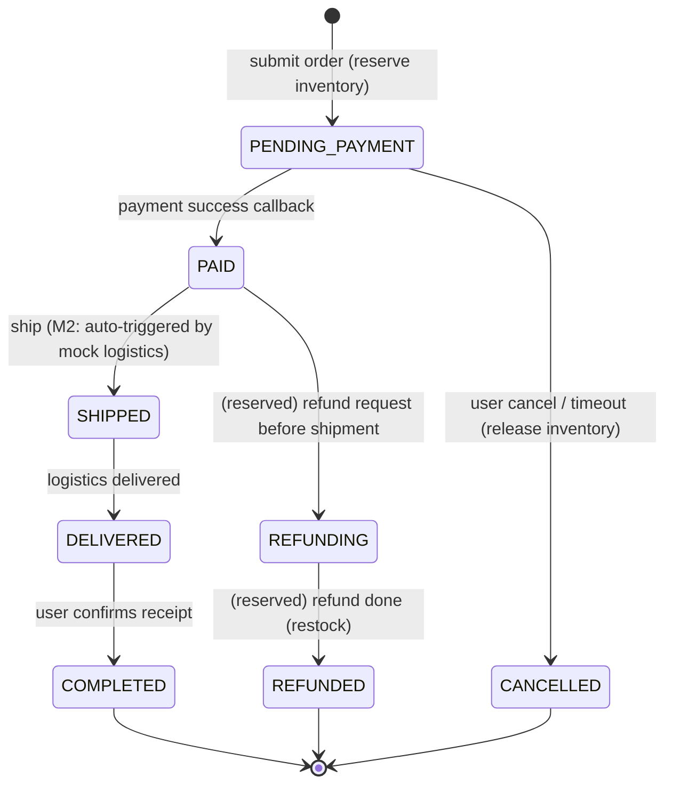
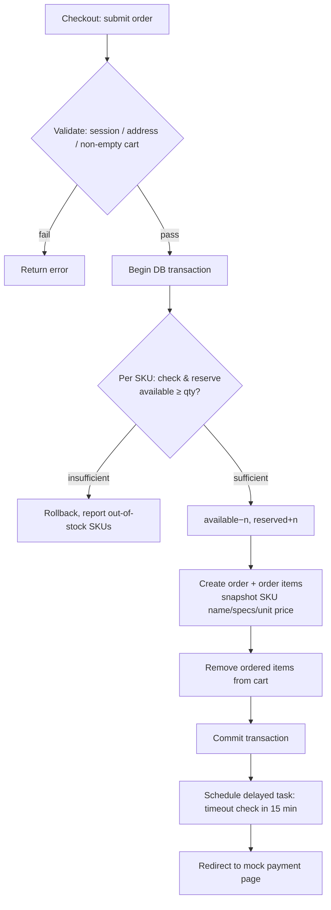
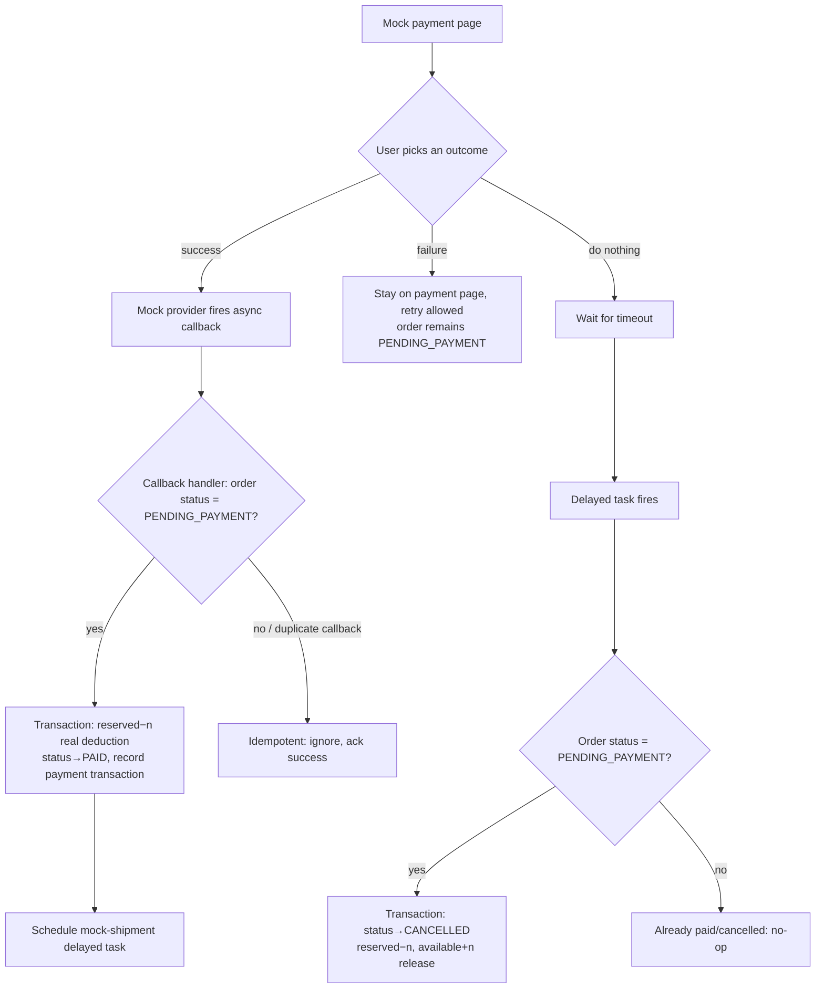
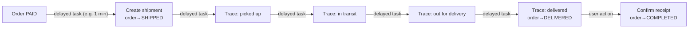

# M0 · Core Business Flows

Covers Journey C (order, payment, fulfillment) with branches and
failure paths. Governing decisions: reserve inventory at order
submission + delayed-task timeout cancellation (ADR-009), after-sales
reserved but deferred, mock payment / mock logistics (PRODUCT_PLAN M2).

## 1. Order state machine

State reference:

| State | Meaning | Side effects on entry |
|-------|---------|-----------------------|
| PENDING_PAYMENT | Awaiting payment | Reserve inventory; schedule the timeout-cancellation delayed task |
| PAID | Paid / awaiting shipment | Convert reservation to real deduction; record payment transaction; schedule mock-shipment task |
| SHIPPED | Shipped | Create shipment record; start trace advancement |
| DELIVERED | Delivered | Await user confirmation (auto-confirm is a reserved feature, also a delayed task) |
| COMPLETED | Completed | End of the loop |
| CANCELLED | Cancelled | Release reserved inventory |
| REFUNDING / REFUNDED | Reserved | Enum values and data model reserved; logic deferred |

Constraint: every transition must check the precondition state
(optimistic: `UPDATE ... WHERE status = <expected>`), and every
transition is appended to an order-events table for traceability.

## 2. Order submission flow (with inventory reservation)

Key points:
- Inventory check and reservation happen in one transaction with
  row-level atomicity (`SELECT ... FOR UPDATE` or atomic
  `UPDATE ... WHERE available >= n`) to prevent overselling under
  concurrency.
- Order items store **price and product snapshots**; later price/name
  changes never affect existing orders.
- The delayed task is scheduled after the transaction commits; if
  scheduling fails, the fallback mechanism compensates (§5).

## 3. Payment flow (mock payment, with failure/timeout branches)

The mock payment service simulates a real third-party provider's
**asynchronous callback** (rather than a synchronous return), so we
exercise callback idempotency and state validation — problems real
payment integrations must handle.

Race note: the timeout task and the payment callback can arrive nearly
simultaneously. Both use "precondition status must be PENDING_PAYMENT"
as an atomic condition, so the database guarantees exactly one wins and
the other becomes a no-op. The extreme case "cancellation just landed,
then the callback arrives" is treated as a failed payment; the mock
stage does not handle refunds (a real integration would — already
covered by the reserved states).

## 4. Mock logistics flow

- Every hop is one delayed task (interval configurable; minute-level
  for demos), reusing the same delayed-task facility as timeout
  cancellation.
- Traces are written to a logistics-trace table; the frontend renders a
  timeline.

## 5. Delayed-task reliability fallback

Delayed tasks are a critical dependency of this design (timeout
cancellation, mock shipment, trace advancement, and the reserved
auto-confirm all rely on them), so failure semantics must be explicit:

- All tasks are **idempotent**: on firing, first validate the business
  precondition; if unmet, no-op. Duplicate delivery is therefore
  harmless and at-least-once semantics suffice.
- Component selection (pg-boss / BullMQ) happens in deliverable ⑤;
  requirements: persistence, due-time delivery, retry on failure.
- Fallback: a manually triggered reconciliation script (scans overdue
  PENDING_PAYMENT orders), positioned strictly as an ops tool — the
  regular path never relies on polling (ADR-009).
