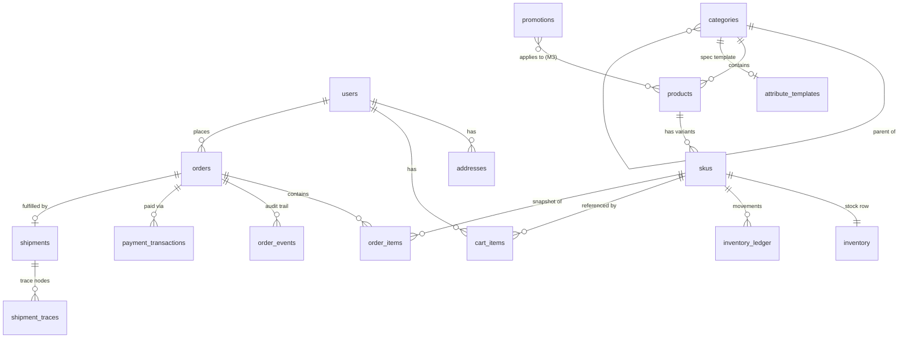

# M0 · Data Model

Scope: core entities and relations for the ecommerce database
(PostgreSQL, database `ecommerce`, ADR in ARCHITECTURE.md). Governing
decisions: product master data owned here, Strapi holds pure content
(ADR-007); tree categories + attribute templates + JSONB specs,
SPU/SKU split (ADR-008); two-phase inventory with reserve/deduct
(ADR-009).

Tables are grouped by future service boundary (user / product / order),
so the M5 schema split maps 1:1 onto these groups.

## Conventions

- **IDs**: `bigint` identity for all internal PKs. Orders additionally
  carry a public `order_no` (string, e.g. date-prefixed random) so
  internal IDs never leak into URLs/receipts.
- **Money**: integer cents (`*_cents bigint`), single currency (CNY)
  for now; no floats anywhere. How these values are represented at the
  API boundary is ADR-016.
- **Time**: `timestamptz`, `created_at`/`updated_at` on every table.
- **Enums**: `text` + CHECK constraint (simpler migrations than native
  enums).
- **Deletion**: catalog entities use a `status` field (no hard
  deletes); orders and ledgers are append-only and never deleted.

## ER overview

## User domain

### users
| Column | Type | Notes |
|--------|------|-------|
| id | bigint PK | |
| email | text UNIQUE | login identifier (simplified auth, Journey D1) |
| password_hash | text | algorithm chosen in deliverable ⑤ |
| display_name | text | |
| status | text | `active` / `disabled` |

### addresses
| Column | Type | Notes |
|--------|------|-------|
| id | bigint PK | |
| user_id | bigint FK→users | |
| receiver_name / phone | text | |
| province / city / district / detail | text | flat region fields; no region-code table for now |
| is_default | boolean | at most one default per user (partial unique index) |

## Product domain

### categories
| Column | Type | Notes |
|--------|------|-------|
| id | bigint PK | |
| parent_id | bigint FK→categories, nullable | tree (ADR-008 ①) |
| slug | text UNIQUE | appears in URLs/API (ADR-008 ③) |
| name | text | |
| sort_order | int | |
| status | text | `visible` / `hidden` |

### attribute_templates
One template per (leaf) category; drives SKU spec dimensions and list
filters (ADR-008 ②).

| Column | Type | Notes |
|--------|------|-------|
| id | bigint PK | |
| category_id | bigint FK→categories | |
| spec_attrs | jsonb | SKU-defining dimensions, e.g. `[{"key":"color","label":"Color","values":["Black","Silver"]},{"key":"storage",...}]` |
| filter_attrs | jsonb | filterable product-level params, e.g. brand, chip; each with key/label/type |

### products (SPU)
| Column | Type | Notes |
|--------|------|-------|
| id | bigint PK | |
| category_id | bigint FK→categories | |
| slug | text UNIQUE | the join key Strapi content refers to (ADR-007) |
| title | text | |
| brand | text | |
| attrs | jsonb | values for the template's `filter_attrs`, used for list filtering; the full marketing spec sheet lives in Strapi, not here |
| status | text | `draft` / `on_sale` / `off_shelf` |

Editorial content (rich description, gallery, spec-sheet page) is a
Strapi content type keyed by `products.slug` — see "Strapi side" below.

### skus
| Column | Type | Notes |
|--------|------|-------|
| id | bigint PK | |
| product_id | bigint FK→products | |
| sku_code | text UNIQUE | |
| spec_values | jsonb | e.g. `{"color":"Black","storage":"256GB"}`; unique per product (unique index on `(product_id, spec_values)`) |
| price_cents | bigint | selling price lives on SKU (ADR-008) |
| status | text | `on_sale` / `off_shelf` |

### inventory
Separate row per SKU so reservation contends on a narrow, lockable row
(ADR-009).

| Column | Type | Notes |
|--------|------|-------|
| sku_id | bigint PK FK→skus | 1:1 |
| available | int CHECK ≥ 0 | |
| reserved | int CHECK ≥ 0 | |

### inventory_ledger
Append-only movement log; makes every reserve/release/deduct auditable
and is the raw material for M4 observability and reconciliation.

| Column | Type | Notes |
|--------|------|-------|
| id | bigint PK | |
| sku_id | bigint FK→skus | |
| order_id | bigint FK→orders, nullable | |
| type | text | `reserve` / `release` / `deduct` / `restock` |
| delta_available / delta_reserved | int | signed |
| created_at | timestamptz | |

## Order domain

### cart_items
Server-side cart for logged-in users only; guest carts live in browser
local storage and merge on login (Journey C1).

| Column | Type | Notes |
|--------|------|-------|
| id | bigint PK | |
| user_id | bigint FK→users | |
| sku_id | bigint FK→skus | UNIQUE(user_id, sku_id); merge adds quantities |
| quantity | int CHECK > 0 | |

### orders
| Column | Type | Notes |
|--------|------|-------|
| id | bigint PK | |
| order_no | text UNIQUE | public-facing |
| user_id | bigint FK→users | |
| status | text | state machine in business-flows.md §1, incl. reserved refund states |
| items_amount_cents / shipping_fee_cents / total_amount_cents | bigint | breakdown; promotions adjust these in M3 |
| address_snapshot | jsonb | receiver/phone/region/detail frozen at submission |
| paid_at / shipped_at / delivered_at / completed_at / cancelled_at | timestamptz nullable | |

### order_items
| Column | Type | Notes |
|--------|------|-------|
| id | bigint PK | |
| order_id | bigint FK→orders | |
| sku_id | bigint FK→skus | reference only; display uses snapshots |
| title_snapshot | text | SPU title at purchase |
| spec_snapshot | jsonb | SKU spec_values at purchase |
| unit_price_cents | bigint | price at purchase |
| quantity | int | |
| subtotal_cents | bigint | |

### order_events
Append-only audit of every state transition (business-flows.md §1).

| Column | Type | Notes |
|--------|------|-------|
| id | bigint PK | |
| order_id | bigint FK→orders | |
| from_status / to_status | text | |
| actor | text | `user` / `system` / `task` / `admin` |
| payload | jsonb | e.g. cancel reason, callback id |
| created_at | timestamptz | |

### payment_transactions
| Column | Type | Notes |
|--------|------|-------|
| id | bigint PK | |
| order_id | bigint FK→orders | |
| provider | text | `mock` for now |
| external_txn_id | text UNIQUE | idempotency key for callbacks (business-flows.md §3) |
| amount_cents | bigint | |
| status | text | `pending` / `success` / `failed` |
| callback_payload | jsonb | raw callback for debugging |

### shipments
| Column | Type | Notes |
|--------|------|-------|
| id | bigint PK | |
| order_id | bigint FK→orders | one active shipment per order in M2 |
| carrier | text | `mock` |
| tracking_no | text | |
| status | text | mirrors trace progress |

### shipment_traces
| Column | Type | Notes |
|--------|------|-------|
| id | bigint PK | |
| shipment_id | bigint FK→shipments | |
| node | text | `picked_up` / `in_transit` / `out_for_delivery` / `delivered` |
| description | text | display text for the timeline |
| occurred_at | timestamptz | |

## Promotion domain (skeleton, implemented in M3)

### promotions
| Column | Type | Notes |
|--------|------|-------|
| id | bigint PK | |
| name | text | |
| type | text | `discount` / `coupon` / … (finalized in M3) |
| rules | jsonb | thresholds, rates; deliberately loose until M3 |
| starts_at / ends_at | timestamptz | |
| status | text | `draft` / `active` / `ended` |

Product–promotion linkage and order-level discount records are designed
in M3; `orders` already carries the amount breakdown so discounts slot
in without reshaping the order tables. Promotion *assets* (banner
images, campaign pages) live in Strapi (ADR-007).

## Strapi side (content types, not in the ecommerce DB)

| Content type | Fields (sketch) | Link |
|--------------|-----------------|------|
| product-content | product_slug, rich-text description, image gallery, spec-sheet blocks | `products.slug` |
| banner | image, link URL, slot, sort, active window | — |
| campaign-page | slug, rich content | referenced by banners/promotions |

The BFF aggregates: product service (master data, price, stock) +
Strapi (editorial content) → one response per page (ADR-007).

## Open items deferred to later milestones

- Region/address code tables (flat text is enough for mock logistics).
- Search indexes (M2 starts with PG `ILIKE`/full-text on
  `products.title`; dedicated engine later).
- Promotion rule details and order-discount records (M3).
- Per-service schema split boundaries follow the three groups above (M5).
