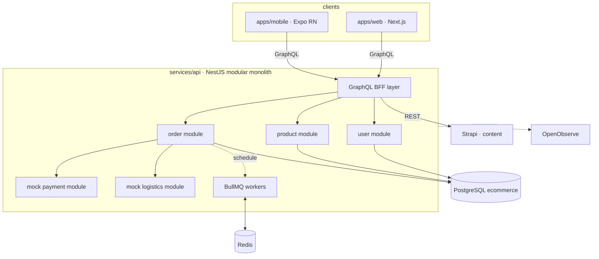

# M0 · Multi-Platform Tech Plan

Deliverable ⑤. Finalizes the "leanings" in ARCHITECTURE.md into
decisions; rationale lives in ADR-010…014.

## Stack summary

| Layer | Choice | Decision |
|-------|--------|----------|
| Web app | Next.js (App Router) | ADR-010 |
| Mobile app | Expo / React Native | ADR-010 |
| Desktop | Tauri — only if ever needed, no M0 commitment | ADR-010 |
| Backend | NestJS, modular monolith until M5 | ADR-010 / ADR-014 |
| Client API | GraphQL at the BFF edge only | ADR-011 |
| Database | PostgreSQL (`ecommerce`, isolated from Strapi) | ARCHITECTURE |
| Delayed tasks | BullMQ + Redis | ADR-009 / ADR-012 |
| Auth | JWT (15 min) + rotating refresh tokens in Redis | ADR-013 |
| Content | Strapi (editorial content / banners / promo assets) | ADR-007 |
| Observability | OpenTelemetry → existing OpenObserve | ADR-004, M4 |
| Deployment | Dokploy (M1–M4) → k3s (M5) | ADR-003 |

## Topology (M1–M4)



One deployable backend during M1–M4; module boundaries mirror the data
model's domain groups so the M5 split follows existing seams (ADR-014).

## Monorepo layout (concretized)

```
apps/
  web/          Next.js storefront
  mobile/       Expo React Native app (joins in M3.5)
services/
  api/          NestJS modular monolith (BFF + domain modules)
  mock-data/    data generator (M2; writes Strapi via API, PG directly)
packages/
  shared-types/ cross-cutting TS types (IDs, enums, money)
  api-client/   GraphQL Code Generator output: typed operations/hooks
                shared by web and mobile
  config/       shared tsconfig/eslint presets
infra/          Dokploy config now; Helm/K8s from M5
docs/           design docs (this folder)
```

`packages/ui` (shared component library) is deliberately deferred:
Next.js renders DOM, RN renders native views — sharing UI code has real
costs. Web and mobile share types and the API client, not components;
design tokens can be extracted later if wanted.

## GraphQL specifics

- **Code-first** with `@nestjs/graphql`: schema generated from TS
  classes; no schema/resolver drift.
- **Client side**: GraphQL Code Generator produces typed operations
  consumed by both web and mobile from `packages/api-client` — the
  end-to-end type chain (DB entity → GraphQL type → client hook).
- **N+1**: DataLoader pattern inside the BFF from day one (product
  list → prices/stock batching).
- **Guardrails**: query depth/complexity limits and persisted-query
  consideration deferred to M6 (security domain).

## Auth flows (ADR-013)

```
login/register mutation
  → access JWT (~15 min) + refresh token (~30 days, rotating,
    stored hashed in Redis)

web:    both tokens in httpOnly SameSite cookies (set by BFF);
        silent refresh on 401
mobile: tokens in Expo SecureStore; Authorization: Bearer header;
        refresh interceptor in the shared api-client
logout / revoke: delete refresh-token hash in Redis
```

Refresh-token **reuse detection** (invalidate the whole family on
replay) is noted for M6; M2 ships plain rotation.

## Delayed-task setup (ADR-009 / ADR-012)

- Queues: `order-timeout`, `mock-shipment`, `logistics-trace`
  (+ reserved `auto-confirm`).
- All handlers idempotent — precondition-state checks per
  business-flows.md §5; at-least-once delivery is sufficient.
- Bull Board mounted in dev / behind admin auth for inspection.
- Redis deployed as a Dokploy container next to the api service.

## What each milestone actually builds with this stack

- **M1**: `apps/web` + `services/api` (product module + a products
  GraphQL query, no auth) + PG schema subset (product domain) + Dokploy
  deploy. Mobile is deliberately absent — M1 proves the pipeline.
- **M2**: user/order/payment-mock/logistics-mock modules; Redis +
  BullMQ go live; full auth. Web only.
- **M3.5**: `apps/mobile` joins, replaying the finished business loop
  on a second platform; codegen moves to `packages/api-client`.
- **M4**: OTel SDK in `services/api`, export to OpenObserve.
- **M5**: split `services/api` into product/order/user services + BFF
  along module seams; Helm charts in `infra/`.
